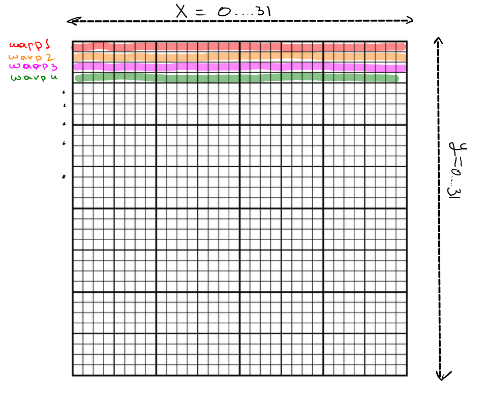

## Задание 1
<em>Пусть на вход дан сигнал x[n], а на выход нужно дать два сигнала y1[n] и y2[n]:</em>

```
 y1[n] = x[n - 1] + x[n] + x[n + 1]
 y2[n] = y2[n - 2] + y2[n - 1] + x[n]
```

<em>Какой из двух сигналов будет проще и быстрее реализовать в модели массового параллелизма на GPU и почему?</em>

### **Ответ:**
Первый. Потому что вычисление первого сигнала зависит лишь от входных данных, что позволит воспользоваться массовым параллелизмом. Во втором случае у нас по сути рекуррентное соотношение и вычисление `y2[n]` зависит от предыдущих вычислений. Таким образом у нас нет возможности распараллелить эту задачу.


## Задание 2
*Предположим что размер warp/wavefront равен 32 и рабочая группа делится на warp/wavefront-ы таким образом что внутри warp/wavefront номер WorkItem по оси x меняется чаще всего, затем по оси y и затем по оси z.*

*Напоминание: инструкция исполняется (пусть и отмаскированно) в каждом потоке warp/wavefront если хотя бы один поток выполняет эту инструкцию неотмаскированно. Если не все потоки выполняют эту инструкцию неотмаскированно - происходит т.н. code divergence.*

*Пусть размер рабочей группы (32, 32, 1)*

```
int idx = get_local_id(1) + get_local_size(1) * get_local_id(0);
if (idx % 32 < 16)
    foo();
else
    bar();
```

*Произойдет ли code divergence? Почему?*

### **Ответ:**


Из условия мы знаем, что warps/wavefronts лягут как на картинке. Так как Work-Group имеет размер (32, 32, 1), а мы берем сначала по `x`, то мы будем брать по строчке. 

Разобравшись в этом, поймем, какое значение на самом деле в `if`. Заметим, что в такой конфигурации `get_local_size(1) == 32`. Тогда в `if` мы имеем `local_id_y + 32 * local_id_x mod 32 = local_id_y mod 32`. Но заметим, что `local_id_y` внутри одного warp/wavefront не меняется. Таким образом *code divergence* не произойдет.

## Задание 3

*Как и в прошлом задании предположим что размер warp/wavefront равен 32 и рабочая группа делится на warp/wavefront-ы таким образом что внутри warp/wavefront номер WorkItem по оси x меняется чаще всего, затем по оси y и затем по оси z.*

*Пусть размер рабочей группы (32, 32, 1).*
*Пусть data - указатель на массив float-данных в глобальной видеопамяти идеально выравненный (выравнен по 128 байтам, т.е. data % 128 == 0). И пусть размер кеш линии - 128 байт.*

(a)
```
data[get_local_id(0) + get_local_size(0) * get_local_id(1)] = 1.0f;
```

*Будет ли данное обращение к памяти coalesced? Сколько кеш линий записей произойдет в одной рабочей группе?*

### **Ответ:**

Конфигурация аналогична заданию 2. Тогда `get_local_id(0)` итерируется от 0 до 31 (в рамках warp/wavefront), `get_local_size(0) * get_local_id(1)` это константа в рамках одного warp/wavefront. Также стоит отметить, что эта константа кратна 32. Из условия на выравнивание и размера `float` получаем, что обращение будет кратно 128. Из этого делаем вывод, что обращение будет coalesced. Также в рабочей группе будет 32 кеш линий записей, так как в рамках одного warp/wavefront она будет одна.

(b)
```
data[get_local_id(1) + get_local_size(1) * get_local_id(0)] = 1.0f;
```

*Будет ли данное обращение к памяти coalesced? Сколько кеш линий записей произойдет в одной рабочей группе?*

### **Ответ:**

`get_local_id(1)` в рамках одного warp/wavefront не меняется. `get_local_size(1) * get_local_id(0) == 32 * x_id`. Это будет последовательность [0, 32, 64, 96,..., 992] плюс константный сдвиг от `get_local_id(1)`. Значит в одном warp/wavefront записи попадут в разные кеш линии. Также, из конфигурации последовательности видно, что каждый warp/wavefront будет делать 32 кеш линий записи. То есть coalesced доступа не будет. Таким образом в рабочей группе будет 1024 кеш линий записи (так как coalesced характерна для одного warp/wavefront).

(c)
```
data[1 + get_local_id(0) + get_local_size(0) * get_local_id(1)] = 1.0f;
```

*Будет ли данное обращение к памяти coalesced? Сколько кеш линий записей произойдет в одной рабочей группе?*

### **Ответ:**

`get_local_id(0)` в рамках одного warp/wavefront меняется от 0 до 31. `get_local_size(0) * get_local_id(1)` будет константой внутри warp/wavefront, кратной 32. Однако есть нюанс: сдвиг на 1 нам все портит (так как `data` выравнен) и мы покроем доступ внутри одного warp/wavefront лишь двумя транзакциями. То есть данное обращение к памяти не coalesced. Также, из-за того что у нас 2 транзакции на warp/wavefront, суммарно в рабочей группе их будет 64.
